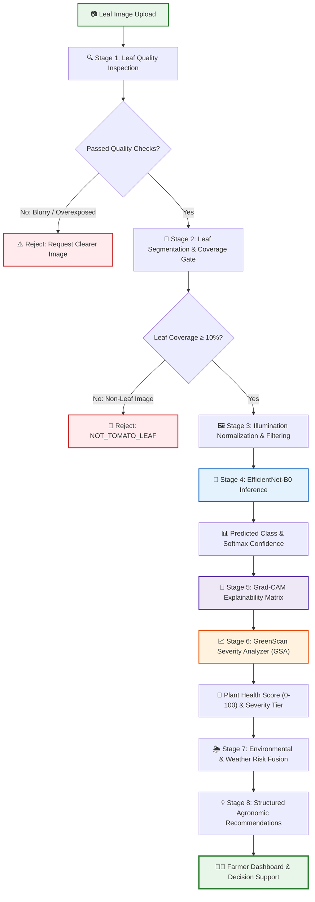
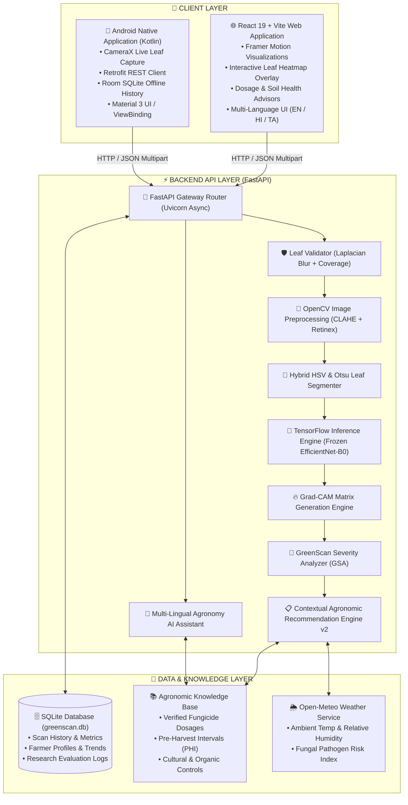
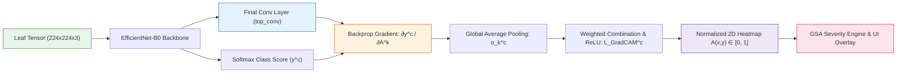
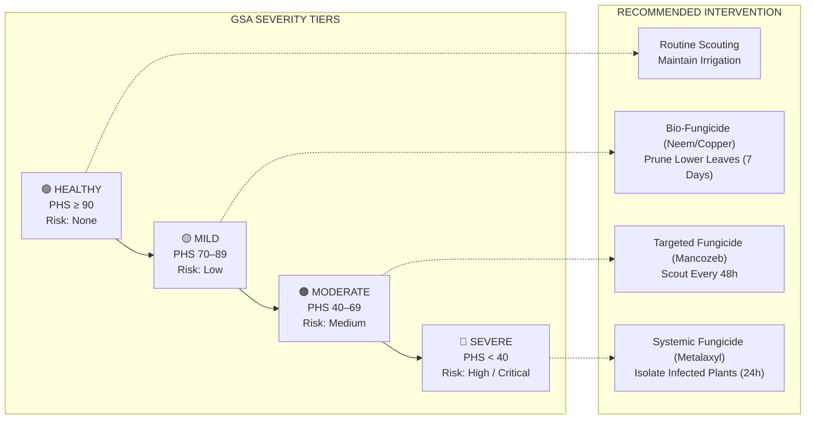

# 🌿 GreenScan

### AI-Powered Plant Disease Detection and Agricultural Decision Support System

[](https://www.python.org/)
[](https://www.tensorflow.org/)
[](https://fastapi.tiangolo.com/)
[](https://react.dev/)
[](https://vitejs.dev/)
[](https://kotlinlang.org/)
[](https://developer.android.com/)
[](https://vercel.com/)
[](https://render.com/)

---

## 📌 Table of Contents

- [1. Project Overview](#1-project-overview)
- [2. Problem Statement](#2-problem-statement)
- [3. Proposed Solution & System Flow](#3-proposed-solution--system-flow)
- [4. Complete System Architecture](#4-complete-system-architecture)
- [5. AI / ML Pipeline & Vision Engineering](#5-ai--ml-pipeline--vision-engineering)
- [6. Target Disease Classes](#6-target-disease-classes)
- [7. Explainable AI — Grad-CAM Engine](#7-explainable-ai--grad-cam-engine)
- [8. GSA: GreenScan Severity Analyzer](#8-gsa-greenscan-severity-analyzer)
- [9. Agricultural Decision Support & Agronomic Modules](#9-agricultural-decision-support--agronomic-modules)
- [10. Research Benchmark & Controlled Experiments](#10-research-benchmark--controlled-experiments)
- [11. Repository Structure](#11-repository-structure)
- [12. REST API Specification](#12-rest-api-specification)
- [13. Local Installation & Setup](#13-local-installation--setup)
- [14. Production Deployment](#14-production-deployment)
- [15. System Limitations & Operational Scope](#15-system-limitations--operational-scope)
- [16. Future Roadmap](#16-future-roadmap)
- [17. Scientific References & Citation](#17-scientific-references--citation)

---

## 1. Project Overview

**GreenScan** is an end-to-end, explainable agricultural artificial intelligence platform engineered for foliar disease diagnosis, physiological severity assessment, and actionable agronomic decision support in tomato crops (*Solanum lycopersicum*).

Unlike conventional "black-box" plant disease classifiers that merely output class probabilities, GreenScan bridges the gap between deep learning research and practical agronomy through a multi-stage pipeline:
1. **Hierarchical Input Validation**: Filters non-leaf imagery and detects blur/illumination defects before inference.
2. **Convolutional Feature Extraction**: Employs an ImageNet-pretrained **EfficientNet-B0** backbone with squeeze-and-excitation attention.
3. **Visual Interpretability**: Computes Gradient-Weighted Class Activation Mapping (**Grad-CAM**) to localize pathological lesion regions.
4. **Spatial Severity Quantification (GSA)**: Translates Grad-CAM activation densities and segmented leaf masks into a bounded **Plant Health Score (0–100)** and 4-tier risk classification.
5. **Contextual Agronomic Guidance**: Formulates organic, chemical, and cultural treatment schedules, dosage calculations, soil health diagnostics, weather risk indices, and multi-lingual chatbot consultation (English, Hindi, Tamil).

```
   ┌──────────────────┐      ┌─────────────────────────┐      ┌───────────────────────────┐
   │ Leaf Acquisition │ ───► │  Vision & ML Inference  │ ───► │ Agronomic Decision System │
   │ (Web / Android)  │      │ (EfficientNet + GradCAM)│      │  (GSA + Treatment + Chat) │
   └──────────────────┘      └─────────────────────────┘      └───────────────────────────┘
```

---

## 2. Problem Statement

Foliar pathology in tomato cultivation causes substantial yield losses worldwide. Smallholder farmers, extension workers, and agronomists face critical operational bottlenecks:

- **Visual Symptom Ambiguity**: Early Blight (*Alternaria solani*) and Late Blight (*Phytophthora infestans*) both produce necrotic foliar lesions. Distinguishing concentric target rings from diffuse water-soaked blights is difficult with the naked eye during transitional stages.
- **Image Quality Variance in the Field**: In-field photography suffers from uncontrolled illumination, motion blur, direct sunlight glare, and complex soil/weed backgrounds.
- **The "Black-Box" Trust Barrier**: Standard neural networks output diagnostic labels without visual justification, preventing agronomists from verifying whether the model focused on authentic lesions or spurious background artifacts.
- **Disconnect Between Classification and Action**: Knowing the disease name alone is insufficient; farmers require quantitative severity assessment, spray volume calculations, and safety windows (Pre-Harvest Intervals).

---

## 3. Proposed Solution & System Flow

GreenScan addresses these challenges with a gated, multi-stage processing pipeline:



---

## 4. Complete System Architecture

GreenScan is structured as a decoupled three-tier enterprise and research architecture:



---

## 5. AI / ML Pipeline & Vision Engineering

```
Input Photo ──► Blur/Light Check ──► Illumination Normalization ──► Leaf Mask ──► EfficientNet-B0 ──► Grad-CAM ──► GSA
```

The diagnostic pipeline comprises four specialized image processing and neural stages:

### 1. Optical Quality Verification ([`backend/image_enhancer.py`](file:///c:/Greenscan%20project/backend/image_enhancer.py))
- **Blur Detection**: Calculates the variance of the Laplacian operator over the grayscale input:
  $$\text{Var}(\nabla^2 I) < 80.0 \implies \text{Reject as blurry}$$
- **Photometric Exposure**: Computes mean pixel luminance to flag underexposed ($< 30.0$) or overexposed ($> 230.0$) captures.

### 2. Illumination Standardization ([`backend/illumination_normalizer.py`](file:///c:/Greenscan%20project/backend/illumination_normalizer.py))
- **Color Constancy**: Corrects atmospheric color cast using Gray-World and White-Patch chromatic adaptation.
- **Dynamic Range Balancing**: Multi-Scale Retinex balancing combined with Contrast Limited Adaptive Histogram Equalization (**CLAHE**) on the luminance channel.
- **Edge-Preserving Denoising**: Bilateral filtering ($d=7, \sigma_{\text{color}}=50, \sigma_{\text{space}}=50$) removes sensor noise while preserving lesion boundaries.

### 3. Foliage Segmentation ([`backend/leaf_segmenter.py`](file:///c:/Greenscan%20project/backend/leaf_segmenter.py))
- Uses a dual-space HSV mask (healthy chlorophyll greens: $H \in [25, 95]$ and chlorotic/necrotic lesions: $H \in [5, 30]$) combined with Otsu adaptive thresholding.
- Morphological closing and opening isolate the primary leaf contour ($N_{\text{leaf}}$ pixels).

### 4. Neural Classification Backbone ([`research/FINAL_MODEL_FREEZE.md`](file:///c:/Greenscan%20project/research/FINAL_MODEL_FREEZE.md))
- **Architecture**: `EfficientNet-B0` pretrained on ImageNet with a frozen feature extraction backbone.
- **Classification Head**:
  ```text
  Input (224 × 224 × 3)
         │
  EfficientNet-B0 Backbone (Frozen, Squeeze-and-Excitation MBConv)
         │
  GlobalAveragePooling2D
         │
  Dense(128, activation="relu")
         │
  Dropout(0.5)
         │
  Dense(3, activation="softmax")
  ```

---

## 6. Target Disease Classes

GreenScan is specifically calibrated and frozen on three clinically distinct diagnostic classes for tomato foliage (*Solanum lycopersicum*):

| Class Label | Pathogen / Condition | Diagnostic Pathology & Foliar Symptoms | Primary Risk Factors |
| :--- | :--- | :--- | :--- |
| **🟢 `tomato_healthy`** | Non-pathogenic | Healthy foliar tissue with uniform chlorophyll distribution, intact venation, and absence of chlorotic/necrotic lesions. | Normal vegetative growth |
| **🟠 `tomato_Early blight`** | *Alternaria solani* (Fungal) | Characteristic dark brown to black concentric target rings surrounded by yellow chlorotic halos, typically initiating on senescing lower leaves. | Moderate temperatures ($24\text{--}29^\circ\text{C}$), high humidity, frequent dew |
| **🔴 `tomato_Late blight`** | *Phytophthora infestans* (Oomycete) | Rapidly expanding, irregular water-soaked pale green to dark necrotic lesions with fuzzy white sporulation on leaf undersides under high humidity. | Cool to moderate temperatures ($15\text{--}22^\circ\text{C}$), relative humidity $>90\%$, persistent leaf wetness |

---

## 7. Explainable AI — Grad-CAM Engine

To ensure transparency and clinical verifiability, GreenScan incorporates Gradient-Weighted Class Activation Mapping (**Grad-CAM**) ([`backend/gradcam_engine.py`](file:///c:/Greenscan%20project/backend/gradcam_engine.py)).



### Mathematical Formulation
For target disease class $c$, the neuron importance weights $\alpha_k^c$ for convolutional feature map $A^k$ of the final convolutional layer are computed via global average pooling of the gradients:

$$\alpha_k^c = \frac{1}{Z} \sum_{i} \sum_{j} \frac{\partial y^c}{\partial A_{i,j}^k}$$

The localization map $L_{\text{Grad-CAM}}^c$ is computed as a rectified linear combination of forward activation maps:

$$L_{\text{Grad-CAM}}^c = \text{ReLU}\left(\sum_{k} \alpha_k^c A^k\right)$$

The map is normalized to $A(x,y) \in [0.0, 1.0]$ across image coordinates.

> [!NOTE]
> **Scientific Integrity Notice**: Grad-CAM serves as a post-hoc **interpretability and visual attribution** mechanism. It highlights spatial receptive fields influencing neural classification; it is not a manual pixel-level ground-truth disease segmentation mask, nor does it modify model weights during inference.

---

## 8. GSA: GreenScan Severity Analyzer

The **GreenScan Severity Analyzer (GSA)** ([`backend/gsa_engine.py`](file:///c:/Greenscan%20project/backend/gsa_engine.py)) is an algorithmic framework that converts raw Grad-CAM heatmaps and leaf segmentation masks into standardized agronomic metrics.

### Quantitative Pipeline

1. **Leaf Area Isolation**: Multi-spectral HSV segmentation extracts the total leaf pixel count ($N_{\text{leaf}}$) and binary leaf mask $M(x, y) \in \{0, 1\}$.
2. **Attention Thresholding**: High-activation disease regions are isolated at threshold $\tau = 0.60$:
   $$M_{\text{activated}}(x, y) = \left(A(x, y) \cdot M(x, y) \ge 0.60\right)$$
   $$N_{\text{activated}} = \sum_{x, y} M_{\text{activated}}(x, y)$$
3. **Attention-Affected Region Percentage**:
   $$\text{Area}_{\text{affected}}\% = \left(\frac{N_{\text{activated}}}{N_{\text{leaf}}}\right) \times 100\%$$
4. **Mean Activation Density**:
   $$\bar{A}_{\text{activated}} = \frac{1}{N_{\text{activated}}} \sum_{(x,y) \in M_{\text{activated}}} A(x, y)$$
5. **Plant Health Score (PHS)**:
   A composite index scaled from $0$ (terminal necrosis) to $100$ (completely healthy):
   $$\text{PHS} = 100.0 - \left[0.60 \times \text{Area}_{\text{affected}}\% + 0.40 \times \left(\bar{A}_{\text{activated}} \times 100\right)\right]$$
   *(For classified healthy leaves, $\text{PHS} = 100.0 - (\bar{A}_{\text{leaf}} \times 5.0)$).*

### Severity Classification & Agronomic Tiers



| Severity Tier | Plant Health Score | Traffic Code | Risk Level | Operational Agronomic Protocol |
| :--- | :---: | :---: | :--- | :--- |
| **🟢 Healthy** | $90 - 100$ | `GREEN` | None | No chemical intervention required. Continue routine scouting and standard fertilization. |
| **🟡 Mild** | $70 - 89$ | `YELLOW` | Low | Remove infected lower leaves. Apply organic bio-fungicides (Neem oil, Bacillus subtilis) within 7 days. |
| **🟠 Moderate** | $40 - 69$ | `ORANGE` | Medium | Apply targeted protectant fungicides (Copper hydroxide, Mancozeb) within 48 hours. Switch to drip irrigation. |
| **🔴 Severe** | $0 - 39$ | `RED` | High / Critical | Immediate emergency response within 24 hours. Apply systemic fungicides (Metalaxyl / Azoxystrobin). Isolate affected crop rows. |

---

## 9. Agricultural Decision Support & Agronomic Modules

GreenScan bridges AI vision with comprehensive farm management tools:

### 1. Contextual Recommendations ([`backend/recommendation_v2.py`](file:///c:/Greenscan%20project/backend/recommendation_v2.py))
- Generates tiered recommendations split across **Immediate Actions**, **Organic Treatments**, **Chemical Options**, **Cultural Practices**, and **Pre-Harvest Intervals (PHI)**.
- Integrates farmer profile metadata (crop stage: *Seedling*, *Vegetative*, *Flowering*, *Fruiting*, *Harvest*) to adjust safety advisories.

### 2. Fungicide & Pesticide Dosage Calculator ([`backend/dosage.py`](file:///c:/Greenscan%20project/backend/dosage.py))
- Calculates chemical tank-mix volumes and formulation rates based on field area (Acres, Hectares, Square Metres).
- Supplies trade names, active ingredient percentages, application frequencies, and pollinator safety guidelines.

### 3. Soil Health Diagnostics ([`backend/soil.py`](file:///c:/Greenscan%20project/backend/soil.py))
- Evaluates soil macronutrients ($N, P, K$ in kg/ha), pH, and moisture.
- Generates corrective soil conditioning advisories (e.g., agricultural lime for acidic soils, compost for organic matter).

### 4. Weather Disease Risk Index ([`backend/weather.py`](file:///c:/Greenscan%20project/backend/weather.py))
- Integrates Open-Meteo GPS weather data.
- Computes pathogen propagation risk by monitoring temperature windows ($15\text{--}25^\circ\text{C}$) and prolonged leaf wetness / relative humidity ($>85\%$).

### 5. Multi-Lingual Agronomy Chatbot ([`backend/chatbot.py`](file:///c:/Greenscan%20project/backend/chatbot.py))
- Multi-lingual assistant (English, Hindi, Tamil) answering farmer inquiries regarding crop pathology, chemical dilution, and spray timing.
- Hybrid architecture: Powered by OpenRouter LLMs with a deterministic static agronomic knowledge base fallback.

---

## 10. Research Benchmark & Controlled Experiments

All models were evaluated under strict **Group-Stratified Partitioning** ($70\% / 15\% / 15\%$) clustered by physical leaf ID ($3,328$ clusters) to guarantee **zero subject leakage** across partitions ([`docs/methodology.md`](file:///c:/Greenscan%20project/docs/methodology.md)).

### 1. Controlled Experiment Benchmark Matrix ($N = 766$ Validation Cohort)

Four controlled single-variable experiments were conducted to eliminate Early $\leftrightarrow$ Late Blight confusion:

| Experiment Setup | Backbone / Architecture | Resolution | Key Intervention | Validation Accuracy | Macro F1 | Early Blight Recall | Early $\leftrightarrow$ Late Errors |
| :--- | :--- | :---: | :--- | :---: | :---: | :---: | :---: |
| **Baseline** | MobileNetV2 (Frozen) | $224 \times 224$ | Frozen ImageNet backbone | $90.60\%$ | $90.89\%$ | $83.33\%$ | 57 |
| **Experiment 1** | MobileNetV2 (Fine-Tuned) | $224 \times 224$ | Unfroze top 29 layers ($\text{lr}=10^{-5}$) | $90.86\%$ | $90.86\%$ | $80.83\%$ | 56 |
| **Experiment 2** | MobileNetV2 (Weighted) | $224 \times 224$ | Balanced class weights ($1.06, 0.67, 1.77$) | $89.95\%$ | $90.46\%$ | $85.00\%$ | 64 |
| **Experiment 3** | MobileNetV2 (High-Res) | $384 \times 384$ | Higher spatial resolution | $89.82\%$ | $90.29\%$ | $82.50\%$ | 63 |
| **Experiment 4 (Final)** | **EfficientNet-B0 (Frozen)** | $224 \times 224$ | Squeeze-and-Excitation channel attention | **93.08%** | **93.18%** | **89.17%** | **39** ($-31.6\%$) |

### 2. Verified Held-Out Test Evaluation ($N = 770$ Images | $511$ Physical Leaf Groups)

The final pre-selected EfficientNet-B0 checkpoint was executed **strictly once** on the held-out test cohort:

| Diagnostic Class | Support ($N$) | Precision | Recall | F1-Score | Status |
| :--- | :---: | :---: | :---: | :---: | :---: |
| **`tomato_Early blight`** | 243 | **89.21%** | **88.48%** | **88.84%** | Verified Frozen |
| **`tomato_Late blight`** | 382 | **93.07%** | **91.36%** | **92.21%** | Verified Frozen |
| **`tomato_healthy`** | 145 | **93.51%** | **99.31%** | **96.32%** | Verified Frozen |
| **Macro Average** | **770** | **91.93%** | **93.05%** | **92.46%** | — |
| **Overall Accuracy** | **770** | — | — | **91.95%** ($708 / 770$) | — |

---

## 11. Repository Structure

```text
Greenscan project/
├── android/                         # Android Mobile Application (Kotlin)
│   ├── app/                         # App Module (MVVM, CameraX, Room, Retrofit)
│   │   ├── build.gradle.kts         # Dependencies (SDK 34, Retrofit, Coroutines)
│   │   └── src/main/                # Kotlin source files & AndroidManifest
│   └── build.gradle.kts             # Top-level Gradle configuration
├── backend/                         # FastAPI Backend Application
│   ├── chatbot.py                   # Context-aware agronomy AI assistant
│   ├── config.py                    # Thresholds, model paths, environment config
│   ├── database.py                  # SQLite ORM & scan history persistence
│   ├── disease_db.py                # Phytopathological data & treatment logic
│   ├── dosage.py                    # Chemical & bio-pesticide dosage calculator
│   ├── farmer_db.py                 # Farmer profile management & longitudinal trends
│   ├── gradcam_engine.py            # Normalized Grad-CAM activation generator
│   ├── gsa_engine.py                # GreenScan Severity Analyzer (GSA) computational protocol
│   ├── illumination_normalizer.py   # Color constancy & Retinex illumination normalization
│   ├── image_enhancer.py            # Laplacian blur & exposure diagnostics
│   ├── knowledge_base.py            # Comprehensive disease pathology knowledge base
│   ├── leaf_segmenter.py            # HSV + Otsu foliage segmentation
│   ├── leaf_validator.py            # Hierarchical quality & leaf coverage gate
│   ├── main.py                      # FastAPI routes, middleware & application entry
│   ├── model_service.py             # Inference management wrapper
│   ├── recommendation_v2.py         # Context-aware structured recommendation engine
│   ├── requirements.txt             # Python backend runtime dependencies
│   ├── soil.py                      # Soil health analysis & amendment advisor
│   └── weather.py                   # Open-Meteo weather integration & fungal risk index
├── dataset/                         # Curated dataset partitions & source data
├── docs/                            # Comprehensive Scientific Documentation Suite
│   ├── error_analysis.md            # In-depth test misclassification study
│   ├── experiment_comparison.md     # Controlled benchmark matrix (Exp 1–4)
│   ├── limitations.md               # Operational boundaries & cautions
│   ├── methodology.md               # Research methodology & group splitting design
│   └── reproducibility.md           # Step-by-step reproduction instructions
├── evaluation/                      # Dataset splitting manifests & summary audits
│   ├── clean_split_manifest.csv     # Group-stratified partition manifest
│   └── clean_split_summary.json     # Split distribution metrics
├── frontend/                        # React 19 + Vite Web Application
│   ├── package.json                 # Frontend dependencies (React 19, Lucide, Leaflet)
│   ├── src/
│   │   ├── components/              # Modular UI components (GradCAM, GSA Gauge, Chat)
│   │   ├── pages/                   # Application pages (Scan, History, Guide, Profile)
│   │   ├── App.jsx                  # Navigation & route definitions
│   │   └── index.css                # Premium responsive styling system
│   └── vite.config.js               # Vite build configuration
├── model/                           # Production deployment model artifacts
│   └── greenscan_model.keras        # Optimized Keras model checkpoint
├── research/                        # Scientific Research, Checkpoints & Benchmarks
│   ├── models/                      # Frozen research model checkpoints (.keras)
│   │   └── greenscan_efficientnetb0_best.keras
│   ├── results/                     # Research metrics, confusion matrices, CSV logs
│   ├── FINAL_MODEL_FREEZE.md        # Official immutable research freeze record
│   └── final_model_metadata.json    # Model metadata & performance metrics
├── scripts/                         # Reproducible Training & Evaluation Pipelines
│   ├── train_efficientnetb0.py      # Model training script with augmentation
│   └── evaluate_efficientnetb0_test.py # Single-pass held-out test evaluation
├── render.yaml                      # Render cloud infrastructure deployment blueprint
├── requirements.txt                 # Top-level Python dependencies
└── README.md                        # Project documentation
```

---

## 12. REST API Specification

The FastAPI backend provides standard RESTful endpoints documented interactively at `/docs` (Swagger UI) and `/redoc`:

| Method | Endpoint | Description | Key Query / Body Parameters |
| :---: | :--- | :--- | :--- |
| `GET` | `/` | API root information and system status | None |
| `GET` | `/health` | Liveness and model pre-warm health probe | None |
| `POST` | `/predict` | Core multi-stage leaf diagnostic pipeline | `file`: Multipart leaf image, `farmer_id` (optional) |
| `POST` | `/chat` | Contextual multi-lingual agronomy AI assistant | `message`, `language`, `context`, `farmer_context` |
| `GET` | `/history` | Returns recent scan history records | `limit` (default: 20) |
| `GET` | `/export-research` | Exports anonymized diagnostic scan history as CSV | None |
| `GET` | `/disease` | Disease catalog and symptom descriptions | `name` (optional filter) |
| `GET` | `/tips` | Curated daily agronomic field tips | `count` (default: 3) |
| `GET` | `/weather` | Weather metrics and fungal risk index | `lat`, `lon` (GPS coordinates) |
| `POST` | `/dosage` | Precision fungicide / pesticide dosage calculator | `disease`, `severity`, `area_value`, `area_unit` |
| `POST` | `/soil-health` | Soil diagnostic analysis and amendment advisor | `ph`, `nitrogen`, `phosphorus`, `potassium`, `moisture` |
| `POST` | `/farmers` | Creates a new farmer profile | JSON object (`name`, `phone`, `pin`, `location`, `crop_stage`) |
| `GET` | `/farmers/{farmer_id}` | Retrieves a farmer profile (PIN hash excluded) | `farmer_id` (path parameter) |
| `PUT` | `/farmers/{farmer_id}` | Updates farmer profile metadata | `farmer_id` (path parameter), update payload |
| `POST` | `/farmers/{farmer_id}/verify` | Authenticates farmer PIN | `farmer_id`, `pin` |
| `GET` | `/farmers/{farmer_id}/history` | Retrieves isolated scan history for a farmer | `farmer_id`, `limit` |
| `GET` | `/farmers/{farmer_id}/trends` | Longitudinal health score and severity trend analysis | `farmer_id`, `limit` |
| `GET` | `/knowledge` | Index of all pathology knowledge base entries | None |
| `GET` | `/knowledge/{key}` | Full structured agronomic knowledge base entry | `key` (e.g. `tomato_Early_blight`) |

### Example Diagnostic Request & Response

#### Request:
```bash
curl -X POST "http://127.0.0.1:8000/predict" \
     -H "accept: application/json" \
     -H "Content-Type: multipart/form-data" \
     -F "file=@test_leaf.jpg"
```

#### Response:
```json
{
  "disease": "tomato_Early blight",
  "display_name": "Tomato Early Blight",
  "confidence": 0.9412,
  "plant_health_score": 58,
  "severity_level": "Moderate",
  "risk_level": "Medium",
  "traffic_light": "🟠",
  "treatment_priority": "Apply targeted copper-based fungicide within 48 hours.",
  "gsa_results": {
    "leaf_pixels": 34210,
    "activated_pixels": 10263,
    "attention_affected_region_percent": 30.0,
    "mean_leaf_activation": 0.3842,
    "mean_activated_activation": 0.7410,
    "threshold_used": 0.60
  },
  "validation": {
    "is_valid": true,
    "validation_status": "VALID_TOMATO_LEAF",
    "leaf_coverage_pct": 68.4
  },
  "structured_recommendation": {
    "urgency": {
      "priority": "Medium",
      "window": "Apply within 48 hours"
    },
    "immediate_actions": [
      "Treat within 48 hours — do not delay.",
      "Remove and destroy all visibly infected plant material."
    ],
    "treatment_options": {
      "organic": ["Neem Oil extract 0.5%", "Copper hydroxide spray"],
      "chemical": ["Mancozeb 75% WP @ 2.0g/L", "Chlorothalonil 75% WP"]
    }
  }
}
```

---

## 13. Local Installation & Setup

### Prerequisites
- **Python**: 3.10 or 3.11
- **Node.js**: v18.0 or higher
- **Android Studio**: Ladybug / Hedgehog (Optional, for Android development)

### 1. Clone the Repository
```bash
git clone https://github.com/Yuvashri2516/greenscan.git
cd greenscan
```

### 2. Backend Setup (FastAPI)
```bash
# Create and activate virtual environment
python -m venv venv

# Windows:
.\venv\Scripts\activate
# Linux / macOS:
source venv/bin/activate

# Install dependencies
pip install -r backend/requirements.txt

# Start backend server
cd backend
python -m uvicorn main:app --reload --host 127.0.0.1 --port 8000
```
API Documentation will be accessible at `http://127.0.0.1:8000/docs`.

### 3. Frontend Setup (React 19 + Vite)
```bash
# In a new terminal:
cd frontend

# Install Node dependencies
npm install

# Start Vite development server
npm run dev
```
Web Application will be accessible at `http://localhost:5173`.

### 4. Android Setup (Kotlin)
1. Open the `android/` directory in **Android Studio**.
2. Sync Gradle files (`build.gradle.kts`).
3. Update API base URL in `RetrofitClient.kt` to your local IP (`http://10.0.2.2:8000/` for emulator).
4. Run on an Android Device or Emulator (API 24+).

---

## 14. Production Deployment

### Production Architecture
- **Backend API**: Containerized on **Render** using `render.yaml` with optimized CPU thread pooling and memory garbage collection.
- **Frontend UI**: Deployed on **Vercel** with static edge distribution.
- **Mobile Client**: Standalone Android APK built via Gradle.

### Render Configuration ([`render.yaml`](file:///c:/Greenscan%20project/render.yaml))
```yaml
services:
  - type: web
    name: greenscan-api
    runtime: python
    buildCommand: pip install -r backend/requirements.txt
    startCommand: uvicorn backend.main:app --host 0.0.0.0 --port $PORT --workers 1
    envVars:
      - key: FRONTEND_URL
        value: "https://greenscan.vercel.app"
      - key: OPENROUTER_API_KEY
        sync: false
      - key: MIN_CONFIDENCE_THRESHOLD
        value: "0.65"
      - key: BLUR_THRESHOLD
        value: "80.0"
      - key: GRADCAM_THRESHOLD
        value: "0.60"
      - key: CUDA_VISIBLE_DEVICES
        value: "-1"
```

---

## 15. System Limitations & Operational Scope

1. **Crop Boundary**: GreenScan is specifically calibrated for **Tomato leaves (*Solanum lycopersicum*)**. It is not validated for other Solanaceae (e.g., potato, eggplant) or unrelated crops.
2. **Tri-Class Diagnostic Scope**: Evaluates Tomato Healthy, Early Blight (*A. solani*), and Late Blight (*P. infestans*). It does not diagnose viral mosaics, bacterial speck, or spider mite damage.
3. **Assistive Nature**: Predictions serve as an assistive decision-support aid. They do not replace formal phytopathological laboratory assays or on-site agricultural extension inspections.
4. **Softmax Output Interpretation**: Softmax probabilities reflect relative model confidence across the three candidate classes; they do not represent absolute uncalibrated Bayesian probabilities.

---

## 16. Future Roadmap

- [ ] **Expanded Pathology Scope**: Integrate classification for Tomato Yellow Leaf Curl Virus (TYLCV), Septoria Leaf Spot, and Bacterial Canker.
- [ ] **On-Device Edge Inference**: Convert the frozen EfficientNet-B0 backbone to TensorFlow Lite (TFLite) with INT8 quantization for zero-latency offline mobile scanning.
- [ ] **Multi-Leaf Panoramic Inspection**: Support multi-leaf and whole-canopy images with bounding-box object detection (YOLOv11).
- [ ] **Satellite & Drone Integration**: Ingest multispectral NDVI imagery for macro-level field blight mapping.

---

## 17. Scientific References & Citation

If you use GreenScan in academic research or agricultural development, please reference this project:

```bibtex
@article{greenscan2026,
  title={GreenScan: An Explainable Deep Learning and Agricultural Decision Support System for Tomato Foliar Pathology},
  author={GreenScan Research Team},
  year={2026},
  journal={GitHub Repository},
  publisher={GitHub},
  howpublished={\url{https://github.com/Yuvashri2516/greenscan}}
}
```

### Key Literature
1. **Tan, M., & Le, Q. V.** (2019). *EfficientNet: Rethinking Model Scaling for Convolutional Neural Networks*. ICML 2019.
2. **Selvaraju, R. R., et al.** (2017). *Grad-CAM: Visual Explanations from Deep Networks via Gradient-Based Localization*. ICCV 2017.
3. **Hughes, D. P., & Salathé, M.** (2015). *An open access repository of images on plant health to enable the development of mobile disease diagnostics*. arXiv:1511.08060.

---

## 📄 License

This project is licensed under the **MIT License** — see the [LICENSE](LICENSE) file for details.
