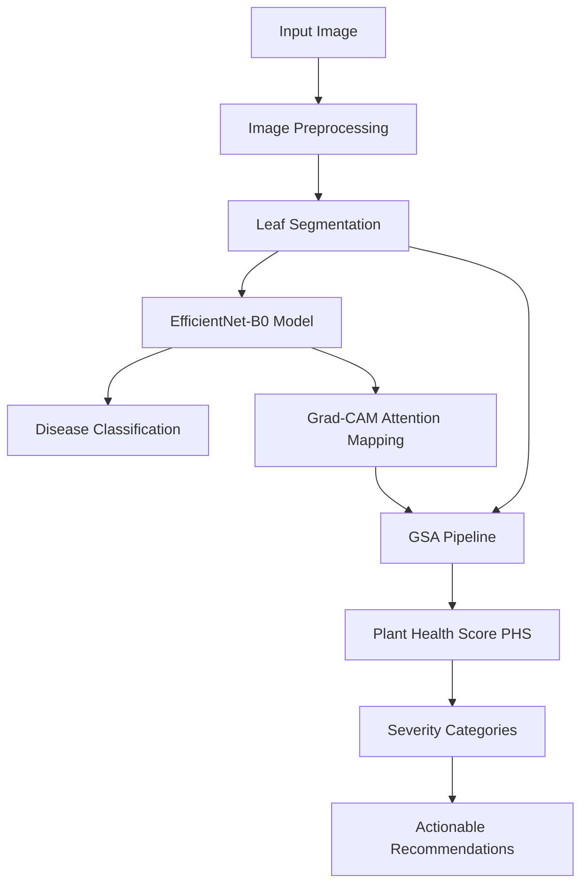

# Methodology

This section outlines the step-by-step GreenScan diagnostic pipeline. The pipeline transitions from raw field photography to explainable classification, GSA relative severity index calculations, and targeted treatment recommendations.

---

---

## 1. Input Image
- **Input:** Raw leaf photograph (JPEG/PNG) uploaded from a mobile camera or storage gallery.
- **Processing:** Encapsulated in a `FormData` structure and transmitted via HTTP POST to the backend FastAPI `/predict` gateway.
- **Output:** Decoded image tensor (RGB format) loaded into memory.
- **Purpose:** Provide the source visual data of the infected or healthy leaf tissue for inspection.

---

## 2. Image Preprocessing
- **Input:** Raw decoded image tensor.
- **Processing:** Image dimensions are standardized using `image_enhancer.py`. It resizes the frame to $(224 \times 224 \times 3)$ pixels using bilinear interpolation, improves contrast using CLAHE (Contrast Limited Adaptive Histogram Equalization), and normalizes pixel values to the range $[0.0, 1.0]$.
- **Output:** Normalized, resized BGR and RGB leaf image tensors.
- **Purpose:** Ensure consistent scaling and lighting, optimizing feature map extraction by the CNN backbone.

---

## 3. Leaf Segmentation
- **Input:** Standardized leaf image.
- **Processing:** Performed in `leaf_segmenter.py`. Color channels are converted from BGR to the HSV (Hue-Saturation-Value) color space. A binary threshold mask ($M_{\text{leaf}}$) is generated using hue bounds ($30 \le H \le 85$, Saturation $\ge 30$) to isolate green foliage, filtering out background pots, shadows, and tables. OpenCV contour analysis estimates the total pixel area of the leaf ($N_{\text{leaf}}$).
- **Output:** Binary leaf mask tensor ($M_{\text{leaf}} \in \{0, 1\}$) and leaf pixel count ($N_{\text{leaf}}$).
- **Purpose:** Isolate the leaf tissue, ensuring Grad-CAM activations are computed only over biological leaf surface area.

---

## 4. EfficientNet-B0 Classification
- **Input:** Resized, normalized RGB leaf image tensor ($224 \times 224 \times 3$).
- **Processing:** The tensor is forwarded through a compiled EfficientNet-B0 network. The final convolutional layer extracts abstract spatial feature maps. Global average pooling collapses spatial vectors before a dense layer computes output probabilities via a softmax activation function.
- **Output:** Probability distribution array for three classes: `tomato_healthy`, `tomato_Early blight`, and `tomato_Late blight`.
- **Purpose:** Perform crop disease classification using an optimized, lightweight backbone network.

---

## 5. Grad-CAM Spatial Attention Mapping
- **Input:** Standardized input tensor and selected class prediction.
- **Processing:** Performed in `gradcam_engine.py`. Backpropagation computes the gradients of the score for the predicted class with respect to the feature map activations of the last convolutional layer. The gradients are global-average-pooled to obtain channel weights, which are linearly combined with the feature maps. A ReLU activation function extracts positive features:
  $$A_{\text{Grad-CAM}} = \text{ReLU}\left(\sum_k w_k^c A^k\right)$$
  The resulting activation grid is resized back to $(224 \times 224)$ using bilinear interpolation and normalized to the range $[0.0, 1.0]$.
- **Output:** Normalized Grad-CAM activation matrix ($G(x, y) \in [0.0, 1.0]$).
- **Purpose:** Isolate spatial regions of the image that contributed most heavily to the model's categorical classification.

---

## 6. GSA Activation Thresholding
- **Input:** Normalized Grad-CAM activation matrix $G(x, y)$ and binary leaf mask $M_{\text{leaf}}$.
- **Processing:** Conducted in `gsa_engine.py`. GSA isolates activations within the leaf mask boundary: $G_{\text{leaf}} = G(x, y) \times M_{\text{leaf}}$. An activation threshold ($\tau = 0.60$) is applied to isolate pixels where model attention is strongest:
  $$M_{\text{activated}}(x, y) = [G_{\text{leaf}}(x, y) \ge 0.60] \cap [M_{\text{leaf}}(x, y) == 1]$$
  The total number of activated pixels ($N_{\text{activated}}$) is counted to estimate the Attention-Affected Region Percentage:
  $$\text{AttentionAffectedRegion\%} = \left(\frac{N_{\text{activated}}}{N_{\text{leaf}}}\right) \times 100$$
- **Output:** Attention-Affected Region Percentage.
- **Purpose:** Quantify the spatial extent of the model's visual attention relative to the leaf surface.

---

## 7. GSA Plant Health Score (PHS) Calculation
- **Input:** Attention-Affected Region Percentage and leaf/activated Grad-CAM values.
- **Processing:** If the predicted class is healthy, PHS is calculated based on the mean activation across the leaf to account for background noise:
  $$\text{PHS}_{\text{healthy}} = 100.0 - (\text{MeanLeafActivation} \times 5.0)$$
  If the predicted class is diseased, PHS is calculated as:
  $$\text{PHS}_{\text{diseased}} = 100.0 - \left(0.60 \times \text{AttentionAffectedRegion\%} + 0.40 \times \text{MeanActivatedActivation} \times 100\right)$$
  The final score is clipped to the range $[0, 100]$ and rounded to the nearest integer.
- **Output:** Quantitative Plant Health Score (PHS) between 0 and 100.
- **Purpose:** Quantify leaf health using a reproducible, spatial-based severity index.

---

## 8. Severity Classification and Recommendations
- **Input:** Plant Health Score (PHS) and categorical classification label.
- **Processing:** PHS is mapped to severity categories: Healthy ($\ge 90$), Mild ($70 \le \text{PHS} < 90$), Moderate ($40 \le \text{PHS} < 70$), and Severe ($< 40$). This categorization determines the risk level, traffic-light status (Green, Yellow, Orange, Red), and treatment urgency.
- **Output:** Severity label and actionable agronomic recommendations (organic amendments, chemical application intervals, and water dilution guidelines).
- **Purpose:** Provide clear, structured decision support for crop disease management.
